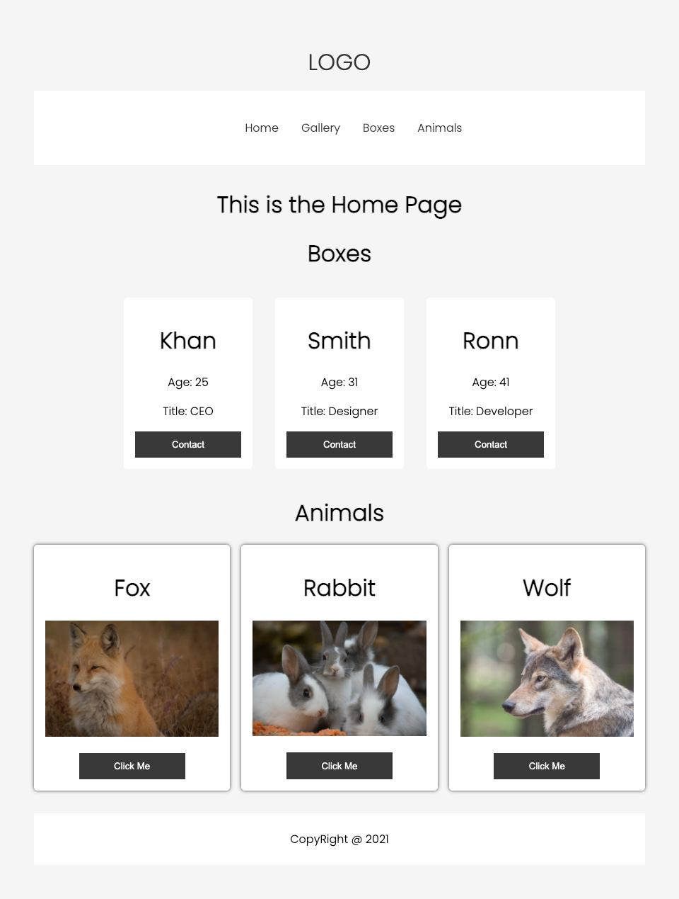

# A Simple School Practice Project

This project was prepared for the practice purpose where we learned how to clean up the React project, style different elements and components, use of Map() method and other usage.

## Project Preview Image

